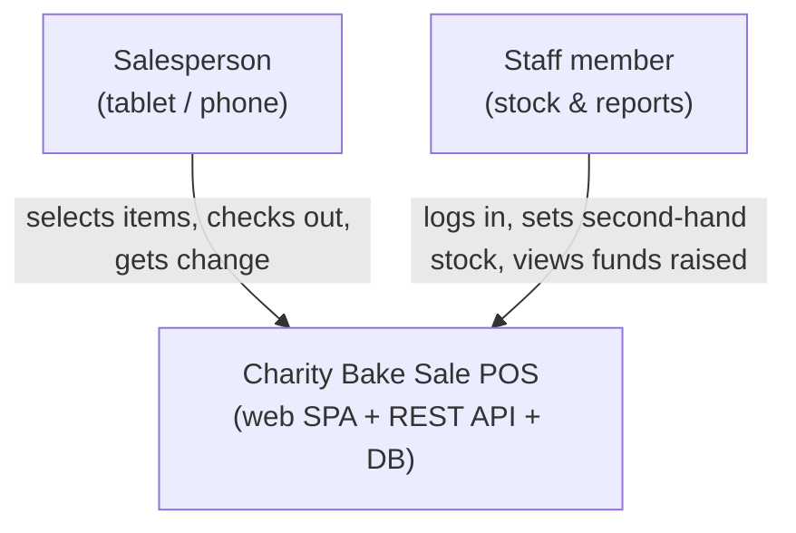
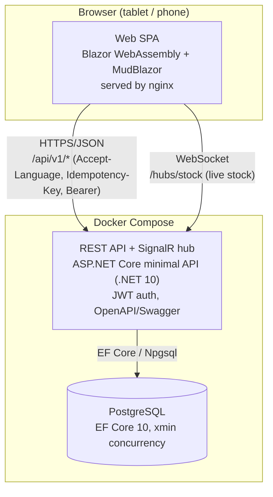
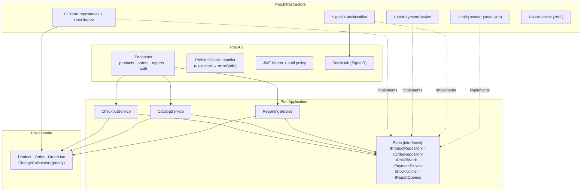
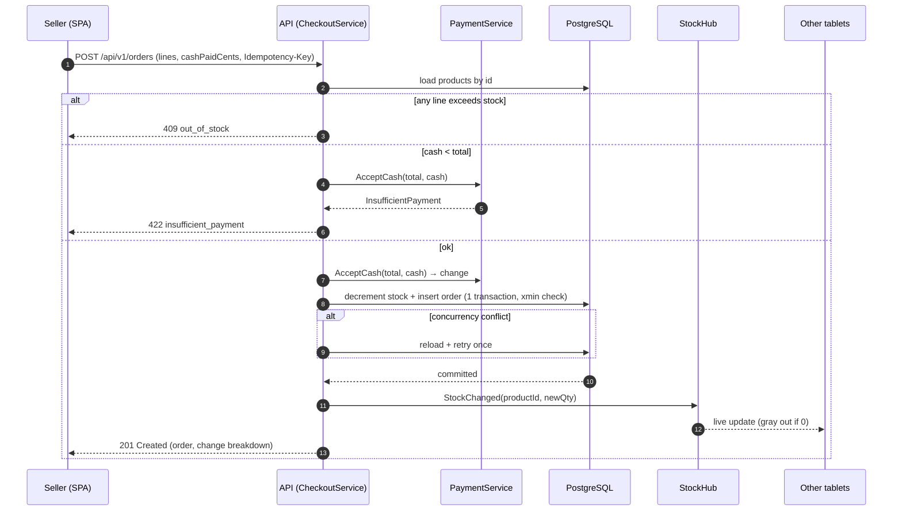
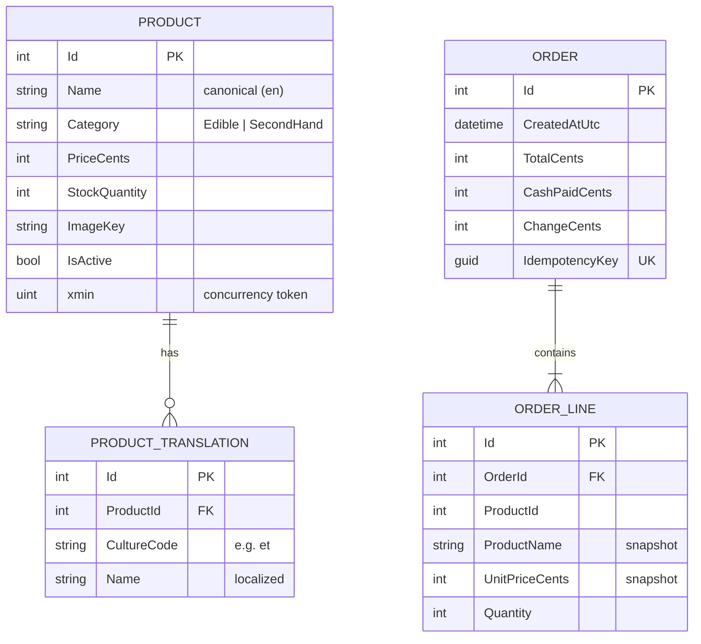

# Architecture

Diagrams for the Charity Bake Sale POS. The system is a separated frontend (Blazor WebAssembly SPA)
and backend (ASP.NET Core REST API + SignalR) over PostgreSQL, packaged with Docker Compose.

- [C4 Level 1 — System Context](#c4-level-1--system-context)
- [C4 Level 2 — Containers](#c4-level-2--containers)
- [C4 Level 3 — API Components](#c4-level-3--api-components)
- [Checkout sequence](#checkout-sequence)
- [Data model (ER)](#data-model-er)

---

## C4 Level 1 — System Context

The POS lets multiple salespeople ring up bake-sale and second-hand purchases concurrently on their
own devices, calculates change, and records sales so the charity can see the funds raised. Staff
authenticate to set second-hand stock and view reports.

---

## C4 Level 2 — Containers

| Container | Tech | Responsibility | Port (compose) |
|---|---|---|---|
| Web SPA | Blazor WASM + MudBlazor, nginx | Product grid, cart, checkout, admin, localization | host `8080` → `80` |
| API | ASP.NET Core (.NET 10) | Catalog, checkout, reports, auth, stock hub | host `8081` → `8080` |
| Database | PostgreSQL 16 | Products, translations, orders, order lines | internal only |

---

## C4 Level 3 — API Components

The API follows lightweight Clean Architecture: dependencies point inward
(Api → Application → Domain); Infrastructure implements Application's ports.

---

## Checkout sequence

Shows the happy path plus the optimistic-concurrency guard and the live stock broadcast.

---

## Data model (ER)

Order lines snapshot the product's canonical name and unit price so historical orders and the
funds-raised report stay correct even if a product is later renamed or repriced. Localized product
names live in `PRODUCT_TRANSLATION` with fallback to the canonical `Name`; money is stored as integer
cents throughout.
